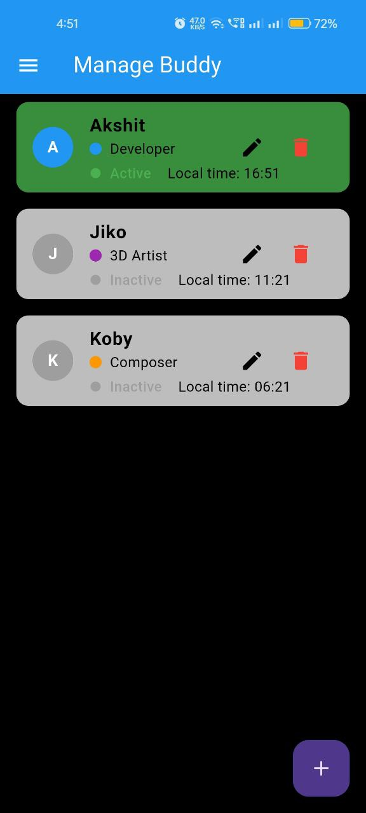

# Manage Buddy

This is a Flutter project for a team management app. almost entirely written by AI. purpose of this project is to not only make Project/Team management app but to show how AI can help quickly turn your small ideas into reality.

## Thoughts 
- In our team, many people are from different time zones and has different working hours. so we need a way to manage our team members.
- using things like Trello, Discord solves the problem of managing tasks but it's hard to know who is active and working or who will get online because there are lot of time zones to calculate and convert
- so we come up with this idea where we can add all members with it's time zone info and it can show who is active and who will get online soon.
- since we didn't had enough time or resource to build it by ourself, we used AI to write this app for us.
- for some experienced Flutter Dev, this might not be a big deal but for us(who don't know much about Flutter) making this app was a great learning experience.

## Tech
- this project was built using [windsurf](https://codeium.com/windsurf) and [cursor](https://www.cursor.com/).

## Features
- it includes simple CRUD functionality for teams members with Time zone Management and Filters. it stores all data locally.
- this project works on WEB and Android both.
- we plan to add more features like task reminders and even server connection so all members can use it directly

## Conclusion
- this is a great example of how AI can help you turn your small ideas into reality.
- this is also `NOT` made to indicate we don't need developers/programmers but to indicate that developers/programmers don't need write whole code line by line.
- surely AI didn't give us perfect code, we had to fix the issue with time zone conversion and also some filters and other minor bugs.
- even with bugs, AI saved us lot of time in setting up the project and UI with simple CRUD. this allow us to make this whole project in just 4 hours.(mostly it was just prompting and a bit of coding)

## Screenshots

  
  
  
  

